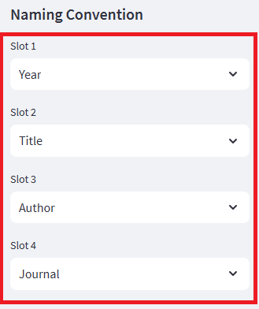
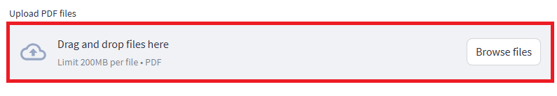
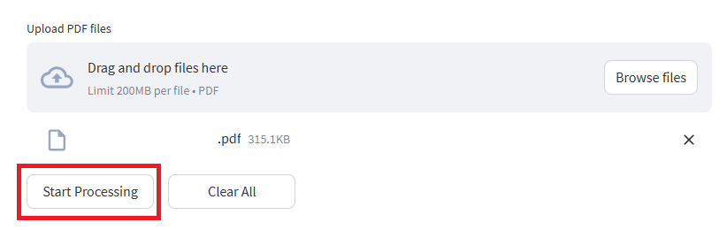

# PaperRenamer
Automatically rename papers in your browser. Extracts metadata from DOI or Title.
This tool runs entirely in your browser. Your PDF files are processed locally and never uploaded to any server.

### Why PaperRenamer?

* **Lightweight**: No bulky software like Zotero or EndNote required.
* **Privacy-First**: Zero installation, zero server uploads.
* **Open & Customizable**: This is an open-source project. Feel free to explore the code and customize it to match your specific workflow.


## 🚀 Usage
### Step 1: Settings
Select your preferred **Naming Convention** in the sidebar. (Default: `Year_Title_Author_Journal.pdf` )



### Step 2: Upload
**Drag and drop** your PDF files into the area, or click **"Browse files"**.


### Step 3: Process
Click **"Start Processing"** and wait for a moment.


### Step 4: Download
Click **"Download ZIP"** to get your renamed files.


---

## 🛠️ Environment & Compatibility
This tool is built with **stlite** (Streamlit for the browser) and runs entirely in your web browser using WebAssembly.
* **Tested Browsers**: Google Chrome (Recommended), Microsoft Edge, Firefox, and Safari. 
* **No Installation**: No Python environment or local installation is required. 

## 🤝 Contributing
Contributions are welcome! If you have suggestions for new features or find any bugs, please feel free to:
1. Open an **Issue** to discuss your ideas. 
2. Submit a **Pull Request** with your improvements. 

## 🔖 Release Notes
* **v1.0.0 (Current)**: Initial public release. Supports DOI and Title metadata extraction via Crossref API. 

## 📄 License, Disclaimer & API Usage

This project is licensed under the **MIT License**.

**Disclaimer**:
This tool is provided for research and educational purposes "as is".
The author does not guarantee maintenance, support, or accuracy.
By using this tool, you agree that the author is not responsible for any issues, damages, or data loss that may occur.

---

## ⚠️ Crossref API Usage

This application uses the Crossref API to retrieve paper metadata.

According to Crossref's API etiquette, you **must include a valid email address** in the User-Agent header so they can contact you in case of excessive requests or issues.

```python
headers = {"User-Agent": "PaperRenamer/1.0 (mailto:your-email@example.com)"　}
```

### 🔹 GitHub Pages Version

The hosted demo may use a placeholder email and is intended **for testing purposes only**.

### 🔹 Recommended Usage

For regular use, please download the HTML file and replace the email with your own.

Failure to follow this guideline may result in API rate limiting or blocking.

## Privacy

This tool may use a simple anonymous counter to measure usage.
No personal data, files, or identifiable information are collected.
---

## 🙏 Credits
* This tool uses the [Crossref API](https://www.crossref.org/) for metadata retrieval.
* Powered by [Streamlit](https://streamlit.io/) and [stlite](https://github.com/whitphx/stlite).
