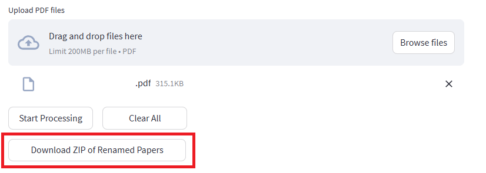

# PaperRenamer
Automatically rename papers in your browser. Extracts metadata from DOI or Title.
This tool runs entirely in your browser. Your PDF files are processed locally and never uploaded to any server.

## 🚀 Usage
### Step 1: Settings
Select your preferred **Naming Convention** in the sidebar. (Default: `Year_Title_Author_Journal.pdf` )

### Step 2: Upload
**Drag and drop** your PDF files into the area, or click **"Browse files"**.

### Step 3: Process
Click **"Start Processing"** and wait for a moment.

### Step 4: Download
Click **"Download ZIP"** to get your renamed files.

